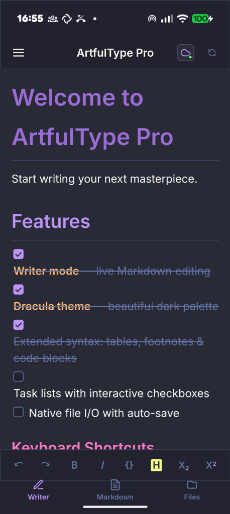
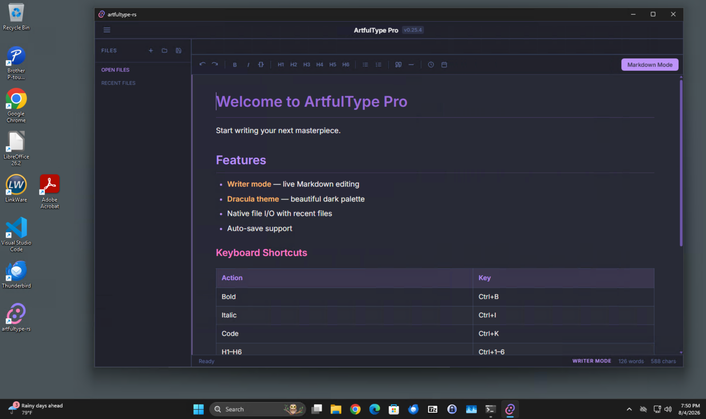
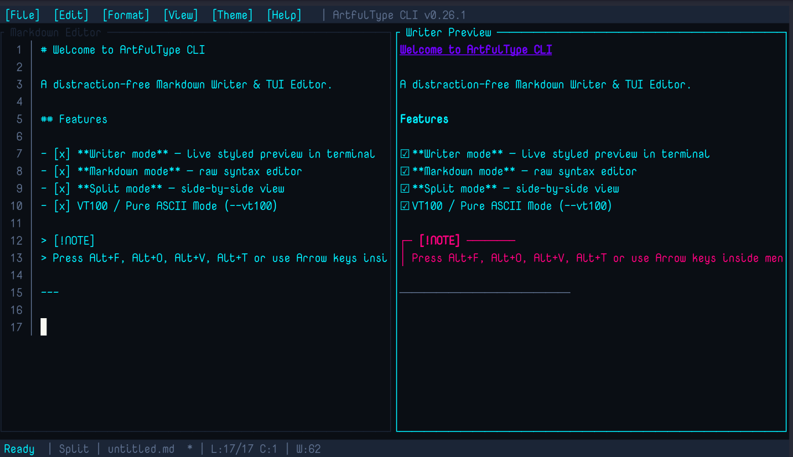
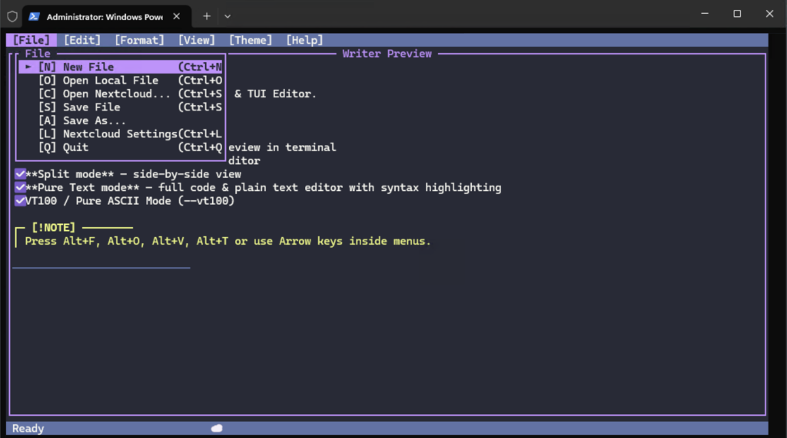

# ArtfulType Pro

A distraction-free Markdown & Code editor built natively for modern desktop environments (**macOS**, **Linux**, and **Windows**) and the terminal using **Rust** and **Tauri**. 

> 💡 **Looking for the classic Macintosh version?**  
> If you're looking for the original System 6/7 68k Mac edition or the Mac OS X 10.5 PowerPC Leopard edition, visit the original repository at [github.com/darkcruix2/ArtfulType](https://github.com/darkcruix2/ArtfulType).

---

## Screenshots

### Android

**Android (Universal APK)**


### GUI (macOS, Windows 11, Linux)

**macOS (ARM64)**


**Windows 11**


**Linux (Debian/Gnome)**


### Terminal TUI (`art`)

**Linux & macOS Terminal — Split View**


**Windows Terminal (PowerShell)**


---

## Features

- **Writer mode** — live Markdown-to-rich-text styled preview
- **Markdown mode** — raw syntax editing
- **Pure Text / Code mode** (`F5` / `-t`) — distraction-free coding and plain text editing with toggleable real-time syntax highlighting (`F6` / `Ctrl+H`) and smart auto-indentation
- **☁ Nextcloud Cloud Integration** — link Nextcloud storage via WebDAV, browse remote directory structures, edit and auto-save directly to Nextcloud in both GUI (`artfultype-rs`) and TUI (`art`)
- **Native File I/O** — Open/Save local plain Markdown & code files
- **Themes & Aesthetics** — Dark mode glassmorphism, Dracula, Retro Green/Amber, DOS Edit, VT100 ASCII modes
- **Cross-Platform** — Native performance on Linux (x86_64), macOS (ARM64), and Windows 11 (x64)

---

## Terminal TUI Editor (`art`)

`art` is a lightweight terminal Markdown & code editor included with ArtfulType Pro.

### CLI Features

- **Four View Modes**: Writer (styled preview), Markdown (raw editor), Split (side-by-side preview & editor), Pure Text / Code Mode (`F5` / `-t`)
- **Toggleable Syntax Highlighting**: `F6` or `Ctrl+H` enables/disables real-time syntax highlighting with status bar indication (`[SYNTAX: ON/OFF]`)
- **Auto-Detection**: Automatically launches in Pure Text / Code Mode when opening code files (`.ps1`, `.psm1`, `.psd1`, `.pwsh`, `.rs`, `.py`, `.c`, `.cpp`, `.js`, `.ts`, `.go`, `.java`, `.sh`, `.json`, `.sql`, etc.)
- **PowerShell Syntax Highlighting**: Full syntax highlighting support for PowerShell scripts, cmdlets (`Get-ChildItem`, `Write-Host`), variables (`$PSScriptRoot`, `$_`, `$true`), parameters (`-Path`, `-Force`), and operators (`-eq`, `-match`).
- **Windows Terminal Integration**: Native Windows console support (`artfultype-cli-windows-x64.exe` / `art.exe`) running smoothly inside Windows Terminal, PowerShell, CMD, or Git Bash with system clipboard sync (`clip.exe` / OSC 52).

### CLI Keyboard Shortcuts

| Action | Linux / Windows | macOS (Terminal) |
| --- | --- | --- |
| Writer Mode | `F2` | `Cmd+Alt+2` / `⌥⌘2` (or `F2`) |
| Markdown Mode | `F3` | `Cmd+Alt+3` / `⌥⌘3` (or `F3`) |
| Split Mode | `F4` | `Cmd+Alt+4` / `⌥⌘4` (or `F4`) |
| Pure Text / Code Mode | `F5` / `-t` | `Cmd+Alt+5` / `⌥⌘5` (or `F5`) |
| Toggle Syntax Highlighting | `F6` / `Ctrl+H` | `Cmd+Alt+6` / `⌥⌘6` / `F6` / `Ctrl+H` |
| Open File Menu | `Alt+F` | `Option+Cmd+F` / `⌥⌘F` (or `Alt+F`) |
| Open Edit Menu | `Alt+E` | `Option+Cmd+E` / `⌥⌘E` (or `Alt+E`) |
| Open Format Menu | `Alt+O` | `Option+Cmd+O` / `⌥⌘O` (or `Alt+O`) |
| Open View Menu | `Alt+V` | `Option+Cmd+V` / `⌥⌘V` (or `Alt+V`) |
| Open Theme Menu | `Alt+T` | `Option+Cmd+T` / `⌥⌘T` (or `Alt+T`) |
| Open Help Menu | `Alt+H` | `Option+Cmd+H` / `⌥⌘H` (or `Alt+H`) |
| Save File | `Ctrl+S` | `Ctrl+S` |
| Quit Application | `Ctrl+Q` | `Ctrl+Q` |
| Indent / Unindent | `Tab` / `Shift+Tab` | `Tab` / `Shift+Tab` |
| Duplicate Line / Selection | `Ctrl+D` | `Ctrl+D` |
| Move Line Up / Down | `Alt+Up` / `Alt+Down` | `Alt+Up` / `Alt+Down` (or `Option+Up/Down`) |
| Bold / Italic / Code | `Ctrl+Alt+B/I/K` | `Ctrl+Alt+B/I/K` |
| Heading 1 / 2 / 3 | `Ctrl+1` / `2` / `3` | `Ctrl+1` / `2` / `3` |
| Copy / Cut / Paste | `Ctrl+Alt+C/X/V` | `Ctrl+Alt+C/X/V` |
| Extend Selection | `Shift+Arrow` | `Shift+Arrow` |
| Clear selection / Cancel | `Esc` | `Esc` |

> **Note for macOS Terminal users**: Standard macOS terminal apps (Terminal.app, iTerm2) intercept single Option/Alt character keys and F-keys (`F1`–`F12`). Use **Option+Cmd** (`⌥⌘`) combinations (e.g. `⌥⌘F` for File Menu, `⌥⌘2` for Writer, `⌥⌘3` for Markdown, `⌥⌘4` for Split, `⌥⌘5` for Pure Text, `⌥⌘6` for Syntax Highlighting).

---

## Pre-built Releases (v0.30.4)

Pre-compiled release binaries and packages are available in the `releases/` directory in this repository:

### Android
## Pre-built Releases (v0.30.4)

See the [releases/](releases/) directory for compiled binaries.

### Android
- **Android (Universal APK)**: [release/ArtfulTypePro-Android.apk](release/ArtfulTypePro-Android.apk)

### Windows
- **GUI Installer**: [releases/artfultype-rs_0.30.4_x64-setup.exe](releases/artfultype-rs_0.30.4_x64-setup.exe)
- **CLI Executable**: [releases/artfultype-cli_0.30.4_x64.exe](releases/artfultype-cli_0.30.4_x64.exe)

### macOS
- **Universal App (Intel + Apple Silicon)**: [releases/ArtfulType_0.30.4_universal.dmg](releases/ArtfulType_0.30.4_universal.dmg)

### Linux (Debian/Ubuntu/Fedora/AppImage)
- **AppImage (compressed 7z)**: [releases/artfultype-rs_0.30.4_amd64.AppImage.7z](releases/artfultype-rs_0.30.4_amd64.AppImage.7z)
- **Debian Package (`.deb`)**: [releases/artfultype-rs_0.30.4_amd64.deb](releases/artfultype-rs_0.30.4_amd64.deb)
- **RPM Package (`.rpm`)**: [releases/artfultype-rs-0.30.4-1.x86_64.rpm](releases/artfultype-rs-0.30.4-1.x86_64.rpm)
- **CLI Debian Package (`.deb`)**: [releases/artfultype-cli_0.30.4-1_amd64.deb](releases/artfultype-cli_0.30.4-1_amd64.deb)
- **Raw Linux Binary**: [releases/artfultype-rs-linux-amd64](releases/artfultype-rs-linux-amd64)

```bash
# Install Linux GUI .deb package:
sudo dpkg -i releases/artfultype-rs_0.30.4_amd64.deb

# Install Linux CLI .deb package (installs /usr/bin/art):
sudo dpkg -i releases/artfultype-cli_0.30.4-1_amd64.deb
```

---

## Building from Source

### Prerequisites

Ensure you have [Rust & Cargo](https://www.rust-lang.org/tools/install) installed.

Install the Tauri CLI via Cargo:

```bash
cargo install tauri-cli --version "^2.0.0" --locked
```

#### System Dependencies

- **Linux (Debian/Ubuntu)**:
  ```bash
  sudo apt update
  sudo apt install libwebkit2gtk-4.1-dev build-essential curl wget file libssl-dev libgtk-3-dev libayatana-appindicator3-dev librsvg2-dev
  ```
- **macOS**:
  ```bash
  xcode-select --install
  ```
- **Windows**:
  - Install [C++ Build Tools](https://visualstudio.microsoft.com/visual-cpp-build-tools/) (WebView2 is pre-installed on Windows 11).

### Running in Development Mode

```bash
cargo tauri dev
```

### Building Release Binaries

```bash
cargo tauri build
```

Or build using the included Makefile:

```bash
make build    # Build release binary
make deb      # Build .deb package
make install  # Install binary & assets to system path
```

---

## License

Code: GPLv3 — see [LICENSE](LICENSE).

Creative assets (the ArtfulType name/branding, icon, and artwork): all rights reserved.

---

## AI Disclaimer

Claude Code and Google DeepMind AI tools were used in the creation of this software.
