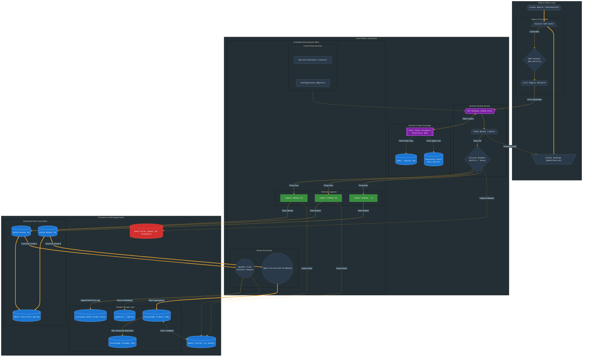

# Platform Architecture

```mermaid
%%{init: {
  'theme': 'base',
  'themeVariables': {
    'primaryColor': '#2b3a4a',
    'primaryTextColor': '#ffffff',
    'primaryBorderColor': '#4a6572',
    'lineColor': '#f9aa33',
    'secondaryColor': '#344955',
    'tertiaryColor': '#232f34',
    'fontFamily': 'Fira Code, monospace',
    'fontSize': '12px'
  }
}}%%

flowchart TB

  %% --- GLOBAL CLASSES ---
  classDef critical fill:#d32f2f,stroke:#ff6659,stroke-width:2px,color:#ffffff,stroke-dasharray: 5 5;
  classDef storage fill:#1976d2,stroke:#63a4ff,stroke-width:2px,color:#ffffff;
  classDef worker fill:#388e3c,stroke:#6abf69,stroke-width:1px,color:#ffffff;
  classDef gateway fill:#7b1fa2,stroke:#ae52d4,stroke-width:3px,color:#ffffff;
  classDef default font-family:monospace;

  %% --- CLIENT / EDGE BOUNDARY ---
  subgraph Edge_Tier ["Edge & Ingress Layer"]
    direction LR
    Client_A(["Client Mobile [iOS/Android]"]):::default
    Client_B[\"Client Desktop [Web/Electron]"/]:::default

    subgraph Ingress_Mesh ["Ingress Proxy Fabric"]
      direction TB
      WAF{"WAF Ruleset<br/><code>mod_security</code>"}
      CDN[/"Anycast CDN Cache"\]
      LB{{"L4/L7 Maglev Balancer"}}
    end
  end

  %% --- API PLATFORM ---
  subgraph Platform_Core ["Core Platform Subsystem"]
    direction TB

    subgraph Auth_Boundary ["Security & Token Exchange"]
      direction RL
      IdP[("OIDC / OAuth2 IdP")]:::storage
      Vault[("HashiCorp Vault<br/><i>mTLS Secrets</i>")]:::storage
      Auth_Svc[["Auth Token Validator<br/>(Stateless JWT)"]]:::gateway
    end

    subgraph Routing_Engine ["Dynamic Routing Domain"]
      APIGateway{{"API Gateway (Kong Core)"}}:::gateway
      RateLimiter{{"Token Bucket Limiter"}}
      CircuitBreaker{"Circuit Breaker<br/><i>Hystrix / Envoy</i>"}
    end

    subgraph Service_Mesh ["Distributed Microservices Mesh"]
      direction TB

      subgraph Ingestion_Cluster ["Telemetry Ingestion"]
        Worker_1["Ingest Daemon 01"]:::worker
        Worker_2["Ingest Daemon 02"]:::worker
        Worker_K["Ingest Daemon ..N"]:::worker
      end

      subgraph Processing_Cluster ["Stream Processing"]
        Flink(("Apache Flink<br/>Stateful Engine"))
        Spark(("Spark Structured Streaming"))
      end

      subgraph Control_Plane ["Control Plane Services"]
        Config_Svc["Configuration Registry"]
        Discovery_Svc["Service Discovery (Consul)"]
      end
    end
  end

  %% --- STORAGE AND EVENT BACKBONE ---
  subgraph Persistence_Backbone ["Persistence & Messaging Fabric"]
    direction BT

    subgraph Kafka_Cluster ["Distributed Event Log (Kafka)"]
      Broker_1[("Kafka Broker 01")]:::storage
      Broker_2[("Kafka Broker 02")]:::storage
      Broker_Z[("KRaft Controller Quorum")]:::storage
    end

    subgraph Database_Cluster ["Polyglot Storage Layer"]
      PG_Primary[("PostgreSQL Primary (RW)")]:::storage
      PG_Replica[("PostgreSQL Standby (RO)")]:::storage
      Cassandra[("Cassandra Wide-Column Store")]:::storage
      VectorDB[("pgvector / Qdrant")]:::storage
    end

    Cache[("Redis Cluster (L2 Cache)")]:::storage
    DLQ[("Dead Letter Queue (S3 Standard)")]:::critical
  end

  %% --- CONNECTIONS ---
  Client_A & Client_B ==> CDN
  CDN -->|Cache Miss| WAF
  WAF --> LB
  LB -->|mTLS Handshake| APIGateway

  APIGateway <-->|Token Inspect| Auth_Svc
  Auth_Svc -.->|Fetch Public Keys| IdP
  Auth_Svc -.->|Fetch Signer Cert| Vault

  APIGateway --> RateLimiter
  RateLimiter -- "Token OK" --> CircuitBreaker
  RateLimiter -. "Exceeded (429)" .-> Client_B

  CircuitBreaker -->|Proxy Pass| Worker_1 & Worker_2 & Worker_K
  CircuitBreaker -. "Tripped (Fallback)" .-> DLQ

  Worker_1 & Worker_2 -->|Event Stream| Broker_1
  Worker_K -->|Event Stream| Broker_2
  Broker_1 & Broker_2 <===> Broker_Z

  Broker_1 ==>|Consumer Group A| Flink
  Broker_2 ==>|Consumer Group B| Spark

  Flink -->|Append Real-Time Logs| Cassandra
  Flink -.->|Vector Embeddings| VectorDB
  Spark ==>|Batch Aggregations| PG_Primary

  PG_Primary -- "WAL Streaming Replication" --> PG_Replica
  PG_Primary <-.->|Evict / Invalidate| Cache

  Worker_1 & Worker_2 -.->|Cache Check| Cache

  Control_Plane -.- APIGateway
  Discovery_Svc --- Service_Mesh

  %% --- ANNOTATIONS ---
  click APIGateway "https://github.com" "Inspect API Gateway Specification"
  click Vault "https://github.com" "Inspect Vault Encryption Details"
  click DLQ "https://github.com" "Alert: High DLQ Drop Rate"
```
